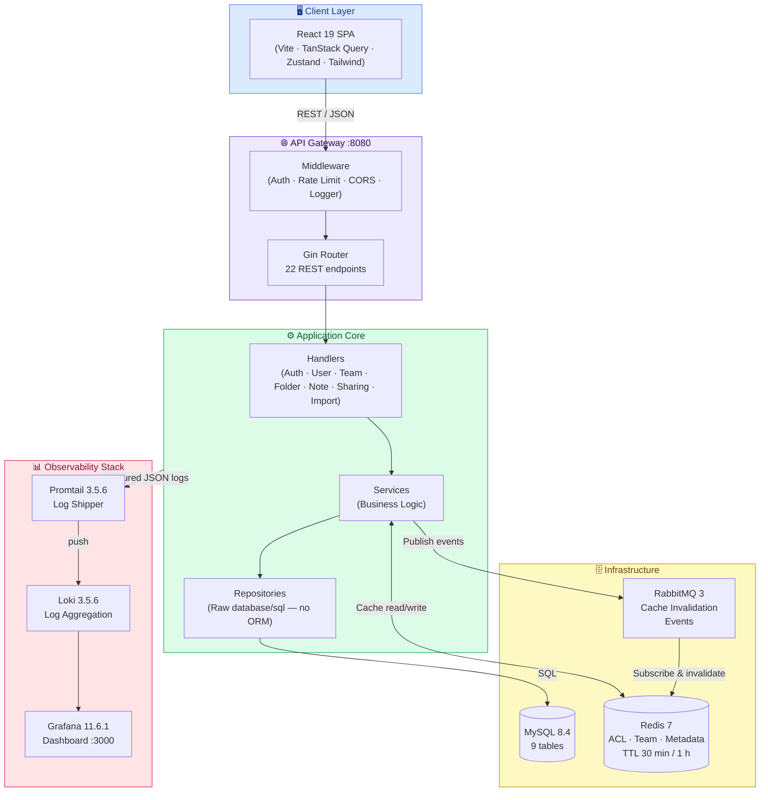
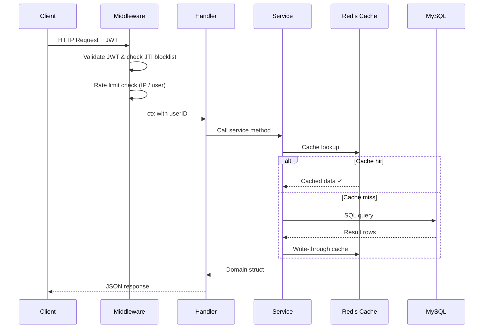
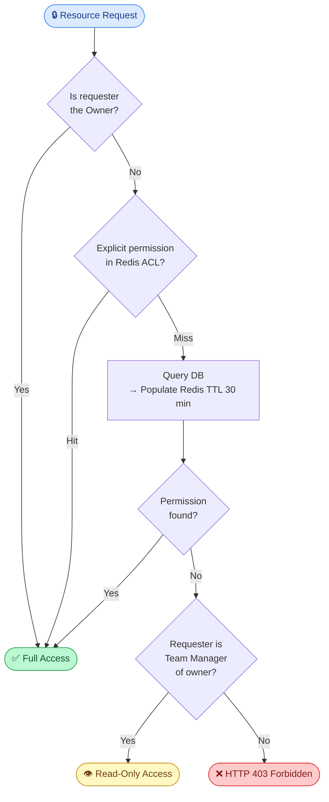
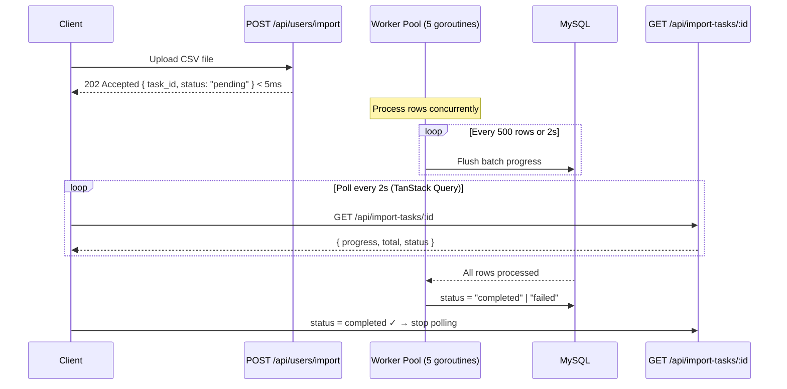
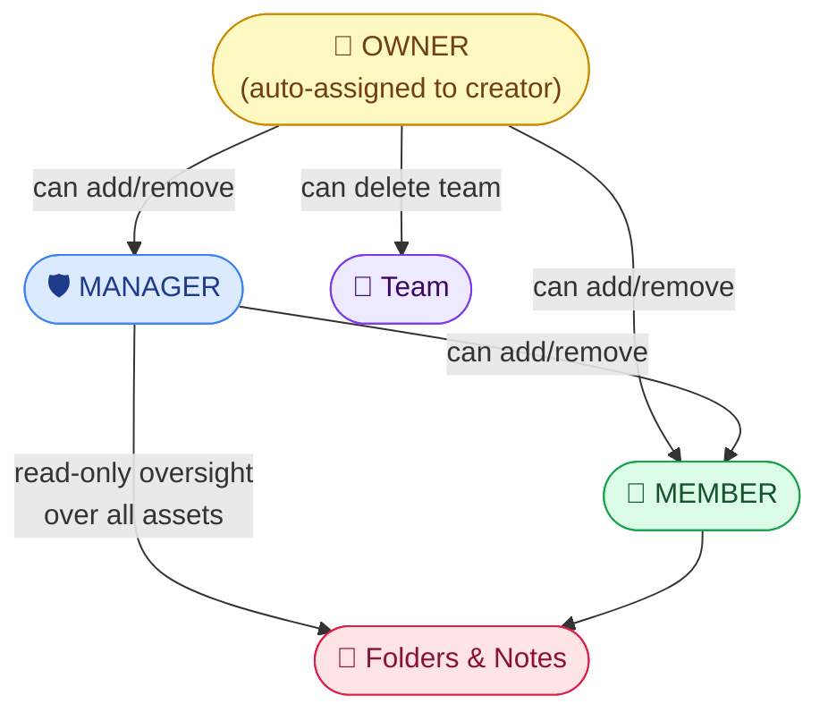
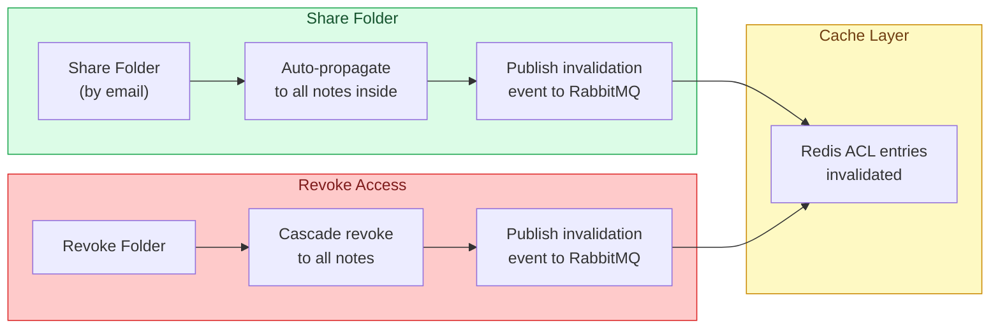
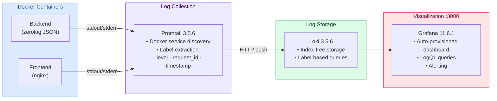

# GoProject — Collaborative Note & Team Management Platform

A full-stack platform built on **Go + React** that lets teams manage users, folders, notes, and shared assets — with real-time async import, fine-grained access control, and built-in observability. Everything ships in a single `docker compose up`.

---

## System Architecture



---

## Request Lifecycle



---

## Access Control Flow



---

## Async Bulk Import Flow



---

## Team Hierarchy



---

## Folder & Note Sharing



---

## Observability Pipeline



---

## Features

### Authentication & Authorization

JWT tokens (HS256, **24-hour expiry**) are issued on login and validated by `AuthRequired` middleware on every protected route. Logout revokes the token via an in-memory JTI blocklist. Two roles — `manager` and `member` — gate endpoint access at the middleware layer.

### Team Roles & Permissions

Three-tier structure: `OWNER > MANAGER > MEMBER`. The creator is automatically assigned `OWNER`. Managers can add and remove members; only owners may remove managers or delete the team. Membership is cached in Redis (**30-minute TTL**) to avoid repeated DB joins on every access check.

### Folder & Note Management

**22 REST endpoints** across 6 domains cover the full asset lifecycle. Every read or write runs a 4-stage access check (Owner → Explicit ACL → Team Manager → Deny). Sharing a folder propagates permissions to all notes inside instantly, and revoking cascades the same way — both operations publish invalidation events to RabbitMQ so distributed cache entries are cleared.

### Async Bulk Import

`POST /api/users/import` returns HTTP 202 with a `task_id` in under 5 ms regardless of file size. A **5-worker goroutine pool** processes rows concurrently, flushing progress to the DB every **500 rows or 2 seconds**. Clients poll `GET /api/import-tasks/:id`; the React frontend uses TanStack Query `refetchInterval: 2000` and stops automatically on terminal state.

### Rate Limiting

Custom two-tier in-memory limiter — zero external dependencies:

| Endpoint | Limit |
| --- | --- |
| `POST /auth/login` | 10,000 req / min / IP |
| `POST /users/register` | 10,000 req / min / IP |
| `POST /users/import` | 5 req / min / IP · 3 req / 10 min per user |

### Observability

All container logs are shipped by **Promtail 3.5.6** to **Loki 3.5.6** and visualized in a **Grafana 11.6.1** dashboard provisioned automatically on first boot. The backend emits structured JSON via **zerolog**; Promtail extracts `level`, `request_id`, and timestamp as Loki labels for fast log-line filtering.

---

## Numbers at a Glance

| Metric | Value |
| --- | --- |
| REST endpoints | 22 across 6 domains |
| Database tables | 9 (+2 migration scripts) |
| DB indexes | 13 (PK, UNIQUE, FK-support) |
| DB connection pool | 25 max open · 5 idle · 5-min lifetime |
| Redis cache TTL — ACL & team | 30 min |
| Redis cache TTL — asset metadata | 1 h |
| JWT expiry | 24 h |
| Import goroutine pool | 5 workers |
| Import progress flush cadence | every 500 rows or 2 s |
| Docker image size | ~30 MB (multi-stage, alpine base) |

---

## Tech Stack

| Layer | Technology |
| --- | --- |
| Backend | Go 1.26.2 · Gin 1.12.0 |
| Database | MySQL 8.4 · raw `database/sql` (no ORM) |
| Cache | Redis 7 · graceful noop fallback |
| Message queue | RabbitMQ 3 · graceful noop fallback |
| Auth | JWT HS256 · bcrypt |
| Frontend | React 19 · Vite 8 · TanStack Query v5 · Zustand v5 · Tailwind v4 |
| Observability | zerolog · Promtail · Loki · Grafana |
| Testing | `go-sqlmock` (no live DB required) |

---

## Quick Start

**Full stack via Docker (recommended):**

```bash
cp .env.example .env          # set JWT_SECRET at minimum
docker compose up -d
# API    → :8080
# App    → :3001
# Grafana → :3000
```

**Local development:**

```bash
# Backend
cd Backend
cp .env.example .env          # DB_HOST, JWT_SECRET required
go mod tidy
go run ./cmd                  # → :8080

# Frontend
cd Frontend/GoProject
npm install
npm run dev                   # → :5173
```

**Run tests (no live DB needed):**

```bash
cd Backend && go test ./...
```

---

## Backend Layer Structure

```text
Backend/
├── cmd/               # Entry point
├── internal/
│   ├── handler/       # HTTP layer  (7 handlers)
│   ├── service/       # Business logic + unit tests
│   ├── repository/    # SQL queries  (raw database/sql)
│   ├── model/         # Domain structs
│   ├── middleware/    # Auth · Rate limit · CORS · Logger
│   ├── cache/         # Redis client wrapper
│   ├── config/        # App + DB + CORS config
│   └── consumer/      # RabbitMQ event consumers
└── rabbitmq/          # Queue / exchange setup
```

---

## Known Limitations

| Area | Current State | Path Forward |
| --- | --- | --- |
| Token revocation | In-memory JTI map — resets on restart | Redis-backed blocklist with TTL |
| Rate limiting | Single-process in-memory | Redis-based limiter for multi-instance |
| Folder share inheritance | Point-in-time: notes added after sharing are not covered | Evaluate on-write vs. on-read resolution |
| Import progress | HTTP polling every 2 s | Server-Sent Events for true push |
| Pagination | All list endpoints return full result sets | `limit` / `offset` or cursor-based |
| Schema migrations | Manual `.sql` files | `golang-migrate` or Atlas |
